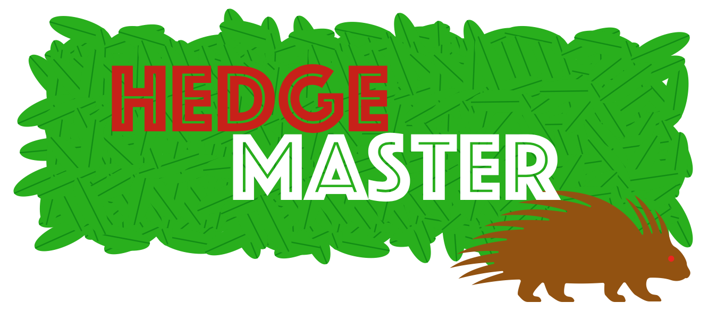

# Hedge Master

*Live Analytics for Long Straddles*

View the google slides presentation for this project [HERE](https://docs.google.com/presentation/d/1jho-Y9KVRi9cY-T4s45JOH7Jc9vdcIuaST3EQQoZYZc/edit?usp=sharing).

## Table of Contents
* Introduction
* Architecture
* Dataset
* Engineering challenges
* Trade-offs
* Installation and Setup

## Introduction

## Architecture

## Dataset

## Engineering challenges

## Trade-offs

## Installation and Setup

### __1. Obtain Alpha Vantage API Key__

This application uses the Alpha Vantage API for its data source. In order to use the program with its current settings you must purchase a premium API key (2 requests / second) which costs $50 / month at the time this document was written. You can adapt the code to use a different data source, however the payload parsing will need to be adapted as well. Additionally, you can use the free version of of the AV API which has a lower request limit but you will need to change the producer code in `kafka-q/producer.py` and `kafka-q/producer_historical.py` to account for this difference in request frequency.

### __2. Create EC2 instances__

In order to run this application you will need two clusters, one for Kakfa/Zookeeper and one for SparkSQL + Spark Streaming. There are many ways to do this but the easiest by far is with [Pegasus](https://github.com/InsightDataScience/pegasus). Follow the pegasus Spark example to get your spark cluster up, then adapt the install script to do the same for a Kafka cluster (creating instances but installing Kakfa instead of Spark). By default, the pegasus example creates a 4 node cluster which this project uses so if you want to use the convenient startup shell scripts, keep the nodes at 4 each cluster.

You will also need to set up a postgres database which you can do easily with [AmazonRDS](https://aws.amazon.com/rds/). Finally you should create another EC2 instance to serve the GUI dashboard (not necessary but reccomended). You may use the default VPC and subnet (you may need to add a second subnet for usage with AmazonRDS) but make sure to set the internet gateway as well as set up an extra security group for the node server dashboard (allowing incoming connections on port 80 from all IPs).

### __3. Clone the repo to the instances and set up environment variables / dependencies__

To run the application you must clone this repo to the spark master node, one of the kafka brokers (where the producer will run) and the webapp server.

The following is a manifest of environment variables needed to be set in `~/.bash_profile` on the machines specified as well as dependencies to install.

Machines: all spark cluster nodes, kafka producer node, webapp server

Linux Dependencies (install using apt install): libpq-dev

Python Libraries (install using pip): psycopg2

Environment variables:

~~~~
CJ_DB_URL=<YOUR_DATABASE_URL_HERE>
CJ_DB_PORT=<YOUR_DATABASE_PORT_HERE>
CJ_DB_UN=<YOUR_DATABASE_USERNAME_HERE>
CJ_DB_PW=<YOUR_DATABASE_PASSWORD_HERE>
~~~~

Machines: kafka producer node

Python Libraries (install using pip): requests

Environment variables:

~~~~
ALPHA_VANTAGE_API_KEY=<YOUR_API_KEY_HERE>
~~~~

Machines: all spark cluster nodes

Python Libraries (install using pip): pyspark

Jars: postgresql-42.2.9.jar, spark-streaming-kafka-0-8-assembly_2.11-2.4.0.jar 
(to use provided shell scripts, put the PG jar in `/usr/local/` and the spark-kafka jar in `~/`)

Environment variables:

~~~~
K_SERVERS=<COMMA_SEPARATED_LIST_OF_KAFKA_CLUSTER_NODE_IP_ADDRESSES>
Z_SERVER=<IP_ADDRESS_OF_ZOOKEEPER_SERVER_ON_KAFKA_NODE>
PG_JDBC_DRIVER=<PATH_TO_postgresql-42.2.9.jar>
~~~~

Machines: webapp server

Linux Dependencies: redis-server, node/npm

Environment variables:

~~~~
SESSION_SECRET=<CHOOSEN_OR_GENERATED_SECRET_STRING> # to be used for session management
~~~~

### __4. Create DB tables + Initialization procedures__

The following are create scripts for the database tables and procedures required to run the application (replace 'sa' with your database username).

You can copy and paste the entire code block into the pgAdmin Query Editor for postgres for a single click setup after spinning up a database instance.

~~~~sql
-- Table: public.daily_prices_temp_tbl
-- Description: table for ingesting daily stock prices

CREATE TABLE public.daily_prices_temp_tbl
(
    symbol text COLLATE pg_catalog."default" NOT NULL,
    date date NOT NULL,
    price_high numeric(8,4),
    price_low numeric(8,4),
    price_open numeric(8,4),
    price_close numeric(8,4),
    price_usd numeric(8,4),
    CONSTRAINT "symbol-date-index" PRIMARY KEY (symbol, date)
)
WITH (
    OIDS = FALSE
)
TABLESPACE pg_default;

ALTER TABLE public.daily_prices_temp_tbl
    OWNER to sa;

-- Table: public.symbol_master_tbl
-- Description: master table for all stock symbols

CREATE TABLE public.symbol_master_tbl
(
    symbol text COLLATE pg_catalog."default" NOT NULL,
    name text COLLATE pg_catalog."default" NOT NULL,
    type text COLLATE pg_catalog."default" NOT NULL,
    region text COLLATE pg_catalog."default" NOT NULL,
    timezone text COLLATE pg_catalog."default" NOT NULL,
    currency text COLLATE pg_catalog."default" NOT NULL,
    CONSTRAINT symbol_master_tbl_pkey PRIMARY KEY (symbol)
)
WITH (
    OIDS = FALSE
)
TABLESPACE pg_default;

ALTER TABLE public.symbol_master_tbl
    OWNER to sa;

GRANT ALL ON TABLE public.symbol_master_tbl TO sa;

-- Table: public.volatility_aggregation_tbl
-- Description: table to hold aggregate values (standard deviation) per time window (2 weeks)

CREATE TABLE public.volatility_aggregation_tbl
(
    symbol text COLLATE pg_catalog."default" NOT NULL,
    start_date date NOT NULL,
    end_date date NOT NULL,
    price_deviation numeric(8,4) NOT NULL,
    average_price numeric(8,4)
)
WITH (
    OIDS = FALSE
)
TABLESPACE pg_default;

ALTER TABLE public.volatility_aggregation_tbl
    OWNER to sa;

-- Table: public.users
-- Description: table for dashboard user information

CREATE TABLE public.users
(
    id bigint NOT NULL DEFAULT nextval('users_id_seq'::regclass),
    username character varying(255) COLLATE pg_catalog."default" NOT NULL,
    password character varying(100) COLLATE pg_catalog."default" NOT NULL,
    type character varying(50) COLLATE pg_catalog."default",
    CONSTRAINT users_pkey PRIMARY KEY (id),
    CONSTRAINT users_username_key UNIQUE (username)

)
WITH (
    OIDS = FALSE
)
TABLESPACE pg_default;

ALTER TABLE public.users
    OWNER to sa;

-- Procedure: public."addSymbol"(text, text, text, text, text, text)
-- Description: function to add a new stock symbol checking if exists first

CREATE OR REPLACE PROCEDURE public."addSymbol"(
	text,
	text,
	text,
	text,
	text,
	text)
LANGUAGE 'plpgsql'

AS $BODY$BEGIN
    IF NOT EXISTS(SELECT 1 FROM symbol_master_tbl WHERE symbol = $1) THEN
		INSERT INTO symbol_master_tbl (
			symbol,
			name,
			type,
			region,
			timezone,
			currency
		)
		VALUES ($1, $2, $3, $4, $5, $6);
	END IF;

END;$BODY$;

~~~~

### __5. Initialize Database__

To collect compatible stock symbols and populate the `symbol_master_tbl` run the script `setup/bg_ingest.sh` on your designated Kafka producer node (EC2 instance in Kafka cluster where you plan to run the producer).

Next initialization step is to gather the historical data. This requires first setting up the streaming pipeline. From your client machine (where you set up EC2 instances with pegasus) run the following commands to start Spark, Kafka and Zookeeper.

~~~~bash
peg service <name-of-spark-cluster> spark start
peg service <name-of-kafka-cluster> zookeeper start
peg service <name-of-kafka-cluster> kafka start
~~~~

After the services have successfully started. Create the Kafka topic on one of the Kafka nodes by running the following (change replication-factor and partitions to account for the number of nodes in your cluster):

~~~~bash
/usr/local/kafka/bin/kafka-topics.sh
    --create --zookeeper localhost:2181 \
    --replication-factor 3 \
    --partitions 3 \
    --topic stock-prices
~~~~

Once the topic is created you can start the spark stream processor (`spark-stream/bg_submit.sh`) on the master spark node. 

After the symbol_master_tbl is finalized and the stream processor is running, start the historical producer by running the python script `kafka-q/producer_historical.py` on the chosen producer instance in the Kafka cluster. (This will take 11+ hours so it's advised to use nohup to run as a daemon).

Finally, run the standard deviation window aggregation on the historical data by running `spark-batch/submit_historical.sh` on the spark master node.

### __6. Start Streaming / Job Scheduling__

After running the historical producer, you can start running the normal producer on the producer machine as a daily cron job as well as the weekly aggregation. To do this add the following to your crontab on the appropriate machine with `crontab -e`:

Kafka Producer Node:
~~~~bash
25 22 * * * source ~/.bash_profile; ~/crossjoinanalytics/kafka-q/bg_submit.sh
~~~~

Spark Master Node:
~~~~bash
0 0 * * 0 source ~/.bash_profile; ~/crossjoinanalytics/spark-batch/submit.sh > ~/v_agg_log.out 2>&1
~~~~

As long as you start these jobs before 100 days after the historical producer finshes, your data should be up to date since each batch of data contains the past 100 days of stock prices, it is only collected everyday so that the data can be the most current.

### __6. Start Dashboard__

Now that the pipeline is complete, start the dashboard to view the results. On the webapp server navigate to the `webapp` directory of this repo and run `npm install` to install NodeJS dependencies.

Then start the redis keystore by running `redis-server` (advised to run as daemon).

Finally, start the dashboard by using the script `webapp/runserver.sh` which runs the server as a background process. You should be able to view your dashboard by navigating to the IP address (or domain if you have set it up) of your webapp server.

